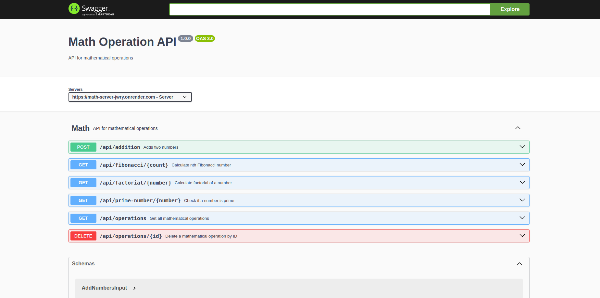

# Project ReadMe

## Overview

This project is a TypeScript and Express-based server built using Node.js and `pnpm` as the package manager. It follows the MVC and repository design patterns. The server provides several API endpoints and uses Swagger for API documentation. SQLite (via Turso) is used as the database, and Prisma is the ORM.

## Live Server

You can access the live server at:  
**[Live Server URL](https://math-server-jwry.onrender.com)**

> **Note:** As the server is deployed on a free instance, it may take up to 60 seconds to respond if it has been inactive.

## Running Locally

### Prerequisites

- Node.js installed
- `pnpm` (preferred) or any other package manager like `npm` or `yarn`
- SQLite database credentials

### Steps

1. Clone the repository:

   ```bash
   git clone <repository-url>
   cd <repository-folder>
   ```

2. Install dependencies:

   ```bash
   pnpm install
   ```

   Or, if using `npm`:

   ```bash
   npm install
   ```

3. Generate Prisma client:

   ```bash
   pnpm run db:generate
   ```

   Or, if using `npm`:

   ```bash
   npm run db:generate
   ```

4. Create a `.env` file in the root directory with the following variables:

   ```env
   PORT=<your-port>
   TURSO_DATABASE_URL=<your-database-url>
   TURSO_AUTH_TOKEN=<your-auth-token>
   BASE_URL=<your-base-url>
   ```

5. Run the server:

   ```bash
   pnpm start
   ```

   Or, if using `npm`:

   ```bash
   npm start
   ```

6. The server will be available at `http://localhost:<PORT>`

## API Endpoints

| Endpoint                    | Description                          |
| --------------------------- | ------------------------------------ |
| `/api/addition`             | Perform addition operations          |
| `/api/fibonnaci/:count`     | Get Fibonacci sequence up to `count` |
| `/api/factorial/:number`    | Get factorial of a number            |
| `/api/operations`           | List all operations                  |
| `/api/operations/:id`       | Get details of a specific operation  |
| `/api/prime-number/:number` | Check if a number is prime           |

## Swagger API Documentation

Swagger is used to generate API documentation. Once the server is running, you can access the Swagger docs at:

- Local server: `http://localhost:<PORT>/api-docs`
- Deployed server: **[Swagger API Docs](https://math-server-jwry.onrender.com/api-docs)**



## Build

The build files are generated in the `dist` folder. To build the project, run:

```bash
pnpm build
```

Or, if using `npm`:

```bash
npm run build
```

## Database

This project uses SQLite from Turso as the database. Prisma is used as the ORM for database operations.

## Tests

The project includes a set of unit and integration tests located in the `src/tests` folder. These tests ensure the reliability and correctness of the server's functionality.

### Running Tests

To execute the tests, use the following command:

```bash
pnpm test
```

Or, if using `npm`:

```bash
npm test
```

### Test Structure

- **Integration Tests**: Verify the interaction between different modules and the overall behavior of the server.

Make sure to run the tests after making any changes to ensure that the application remains stable.


## Contributing

Feel free to fork the repository and submit pull requests.

## License

[MIT License](LICENSE)
